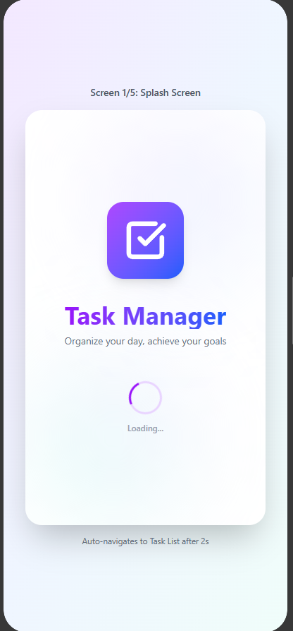
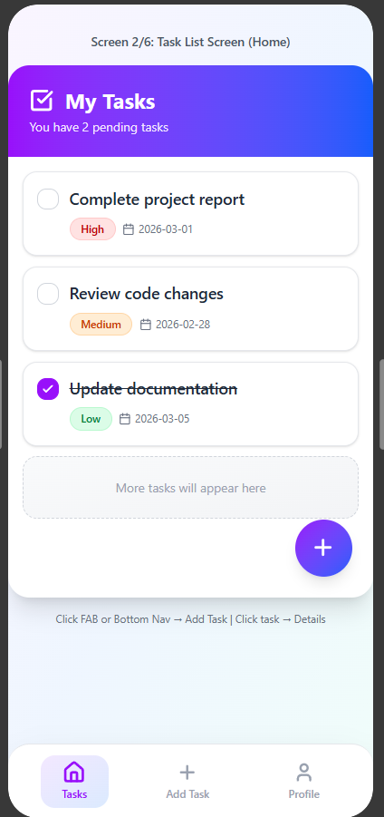
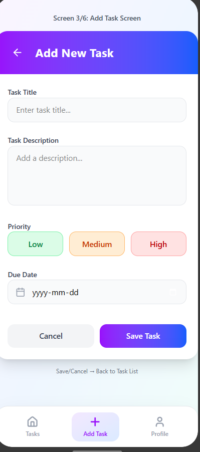
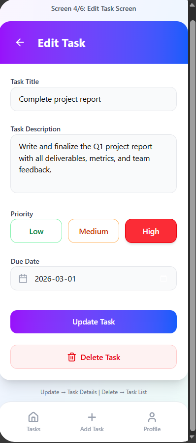
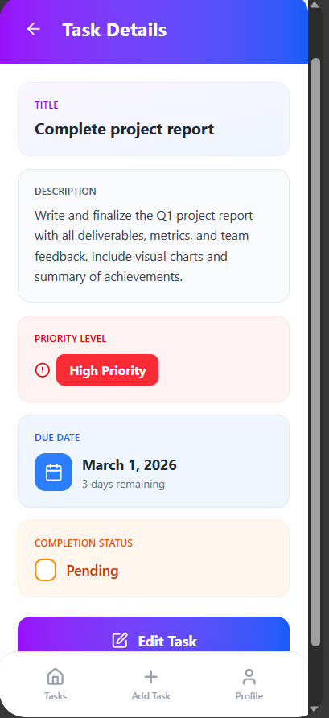
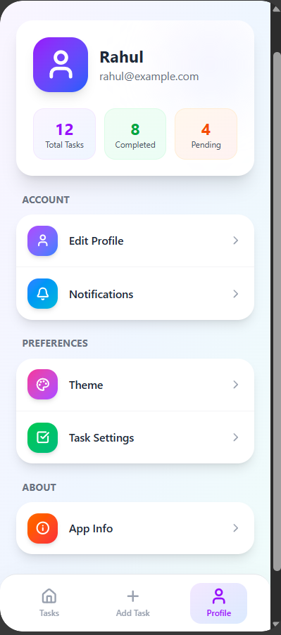

# FocusList 📝  
### A Modern Task Manager for Android

FocusList is a modern Android task management application designed to help users organize daily activities, manage priorities, and stay productive.  
The app focuses on simplicity, clean design, and essential features, making task management easy and effective for everyday use.

---

## ✨ Features
- Create, edit, and delete tasks  
- Assign priority levels (Low, Medium, High)  
- Set due dates for tasks  
- Mark tasks as completed  
- View detailed task information  
- Bottom navigation for quick access to main sections  
- Clean, colorful Material 3–inspired user interface  

---

## 🛠 Tech Stack
- **Android Studio**
- **Kotlin**
- **Jetpack Compose**
- **Material Design 3**
- **Room Database (SQLite)**
- **MVVM Architecture**

---

## 📱 App Screens

### Splash Screen

### Task List

### Add Task

### Edit Task

### Task Details

### Profile

---

## 🧠 Architecture Overview
FocusList follows the **Model–View–ViewModel (MVVM)** architecture pattern to maintain a clean separation of concerns.

- **View:** Jetpack Compose UI screens responsible for displaying data and handling user interaction  
- **ViewModel:** Manages UI state and business logic  
- **Model:** Repository and Room database used for data persistence  

This architecture improves maintainability, scalability, and testability.

---

## 🗄️ Database
The application uses a local **Room database** to store task information, ensuring data persistence even when the app is closed.

Each task includes:
- Title  
- Description  
- Priority level  
- Due date  
- Completion status  

---

## 🧪 Testing
The project includes:
- **Unit tests** to verify task data operations and business logic  
- **Instrumentation (UI) tests** to validate Jetpack Compose screens and navigation  

Testing ensures reliability and a consistent user experience.

---

## 🚧 Project Status
- ✅ Project proposal completed  
- ✅ UI wireframes designed using Figma  
- ✅ Database and architecture planned  
- 🔄 Implementation in progress  

---

## 👨‍💻 Author
**Rahul Mahyavanshi**  
Team: **LogicLabs**

---

## 📄 License
This project is created for academic purposes as part of a final term project.
